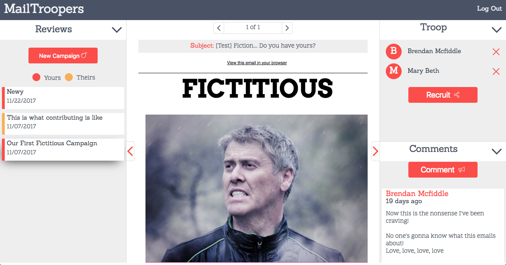

# MailTroopers

MailTroopers allows team collaboration when creating email drip campaigns. When creating a campaign, the user is given a unique email address to send to. The user sends the campaign to that email for review and it is added as a version. Users can then recruit people to their team to leave comments and suggestions.

## Key Features

* Users can create new campaigns to review their emails
* Each newly created campaign generates a custom email for the user to send the email for review to
* Each time an email is sent a new version is created
* Users can recruit other users to review and comment on versions

## Credits and Tools
This software uses code from several open source packages.
* React.js and Redux
* Node.js
* SocketIO
* mongoDB and Mongoose
* Passport
* webpack
* TravisCLI
* Enzyme and Jest
